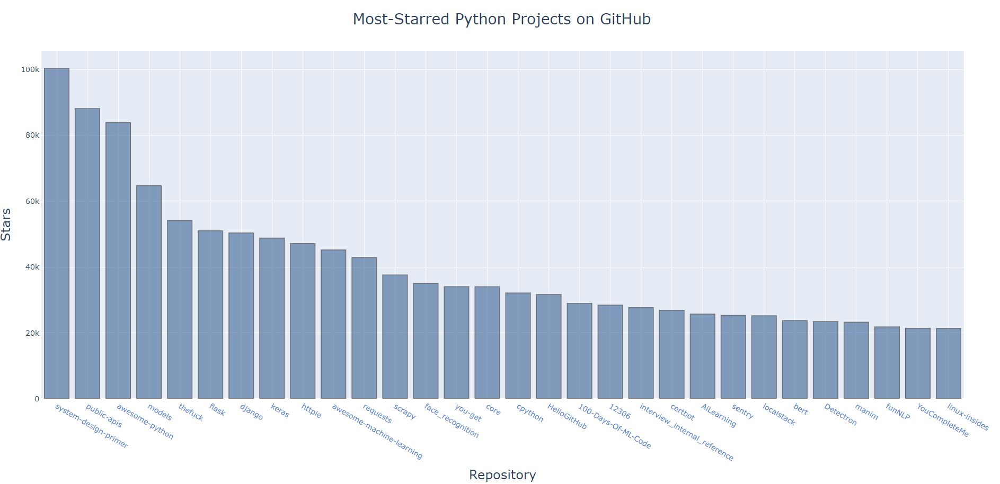

# MostStarredGithubProjects

## Description
Using the GitHub api to get the most starred project

After getting data from GitHub, Use plotly to visualize data with the number of stars in adjacent order of GitHub projects
